# DOCUMENTACIÓN API REST BLOG.

### En este documento se encuentra la documentacion de una API REST hecha con Nodejs, Express y Mongoose.

## Descripcion:

API REST de blog que contiene las entidades user y article las cuales estan relacionadas donde un usuario puede tener varios articulos (**Relación 1 a N**).

Sus rutas se encuentran protegidas mediante JWT y con permisos para usuarios que tengan roles tales como _"admin" o "user"_.

Se implemento docker para poder tener un contenedor donde tengo instalado nodejs, mongo y mongo-express.

### **Se usarón librerias como:**

- **_Express-validator_** para validar los datos ingresador por teclado.

- **_Swagger-jsdoc_** y swagger-ui-express para generar la documentación de la API.

- **_Bcryptjs_** para encriptar la contraseña.

- **_Jsonwebtoken_** para transmitir información de un usuario de forma segura entre un cliente/servidor.

- **_Dotenv_** para manejar las variables de entorno que no tienen que ser vistas por las personas.

## **1. Instalar dependencias:**

```
npm install

```

## **2. Inicializar proyecto:**

```
npm run dev

```

# **Levantar proyecto con DOCKER:**

## **1. Buildear Proyecto: **

```
docker-compose build

```

## **2. Levantar Proyecto: **

```
docker-compose up

```

# **Imagenes de swagger:**

## **Swagger**

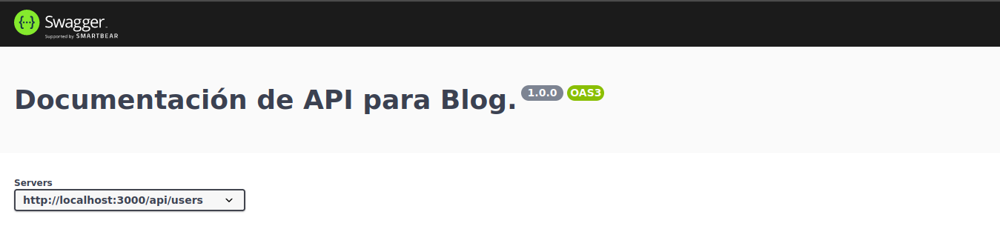

## **Documentacion de articulos:**

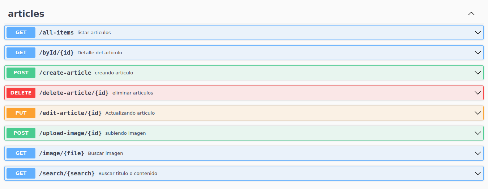

## _Todos los articulos_:

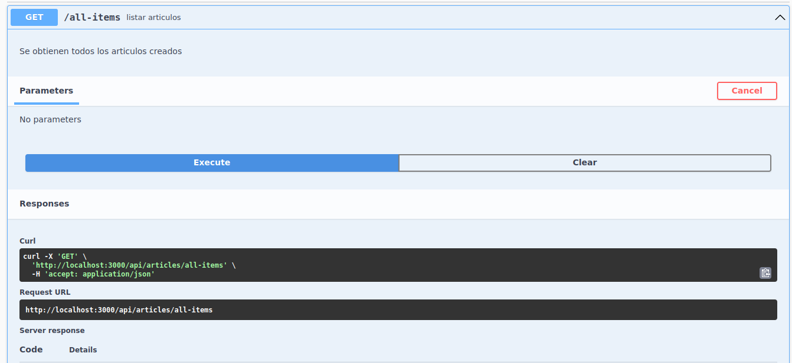
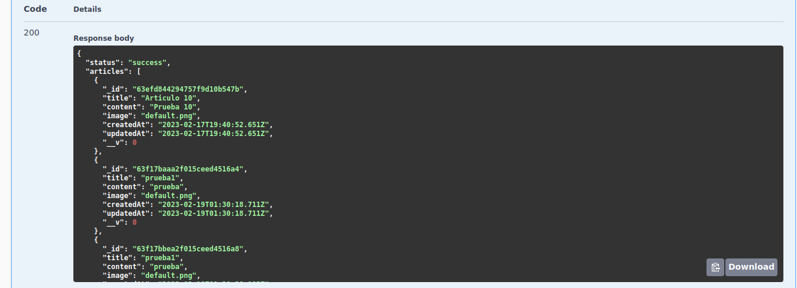
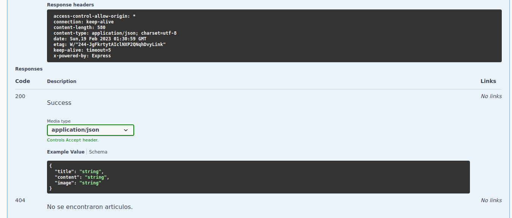

## **Articulo por ID:**

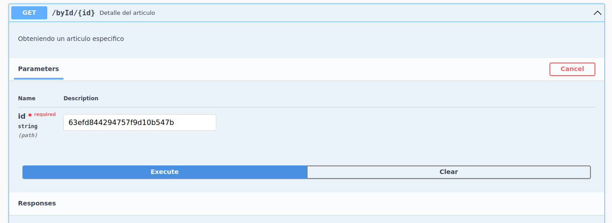
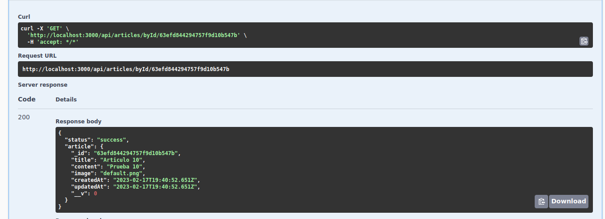
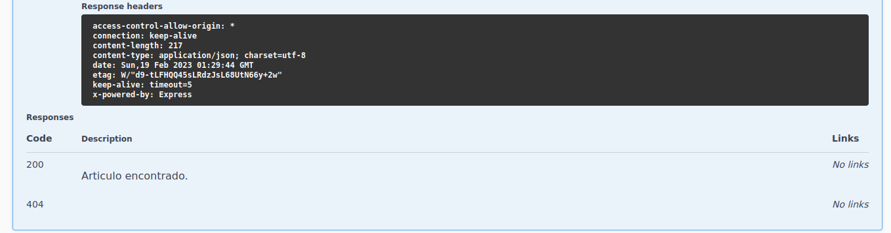

## **Crear Articulo:**

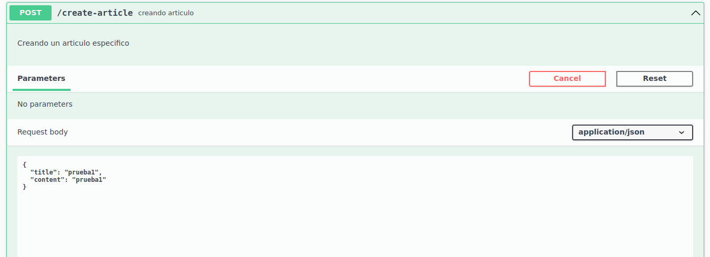
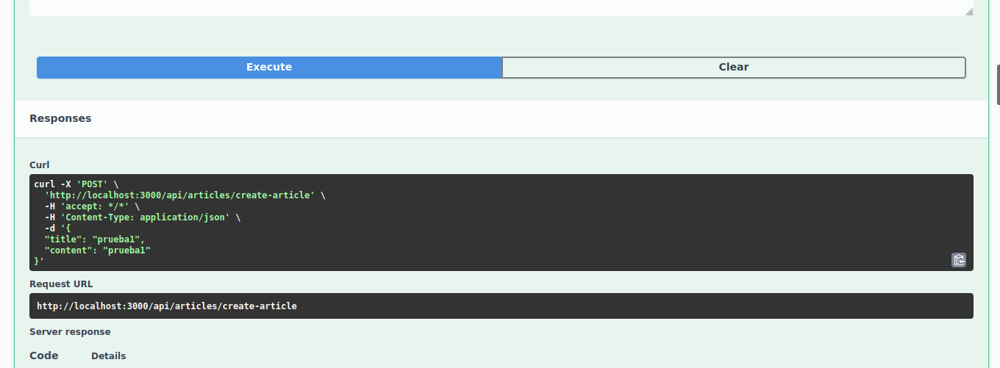
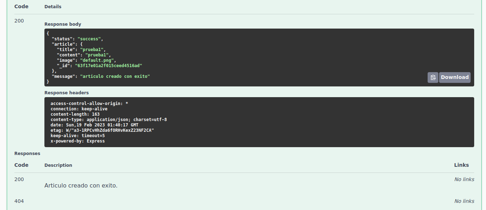

## **Eliminar Articulo:**

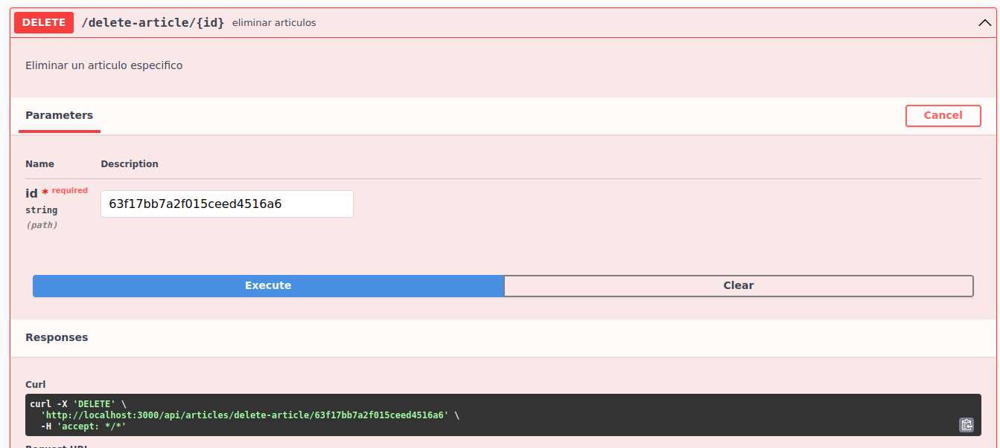
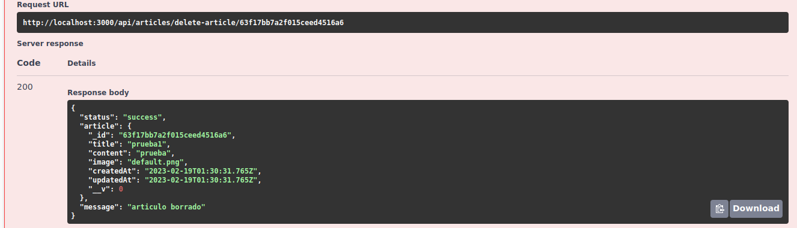
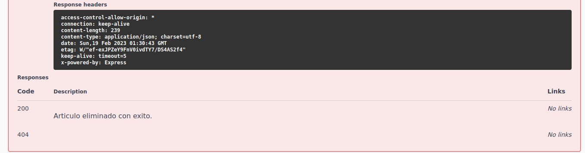

## **Actualizar Articulo:**

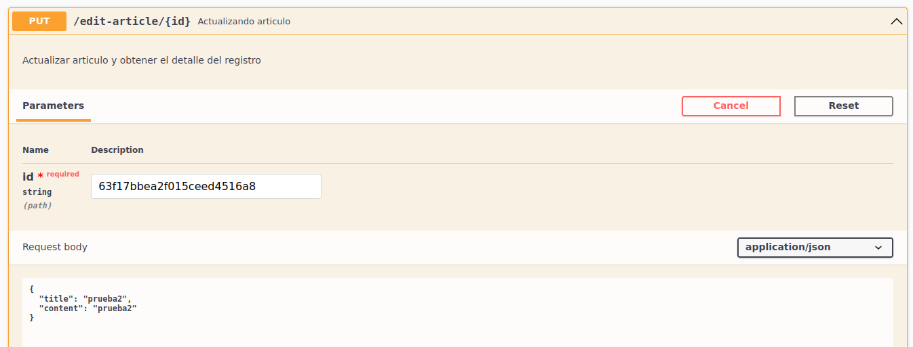
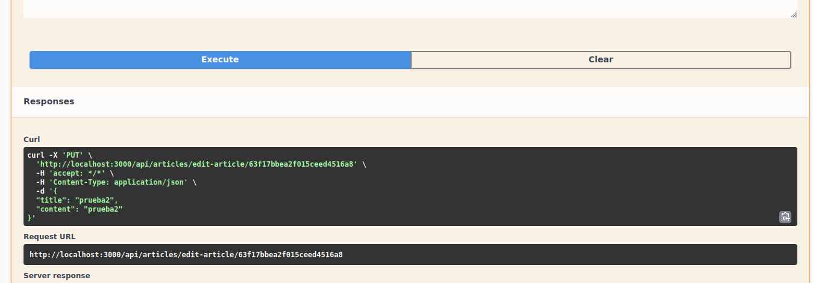
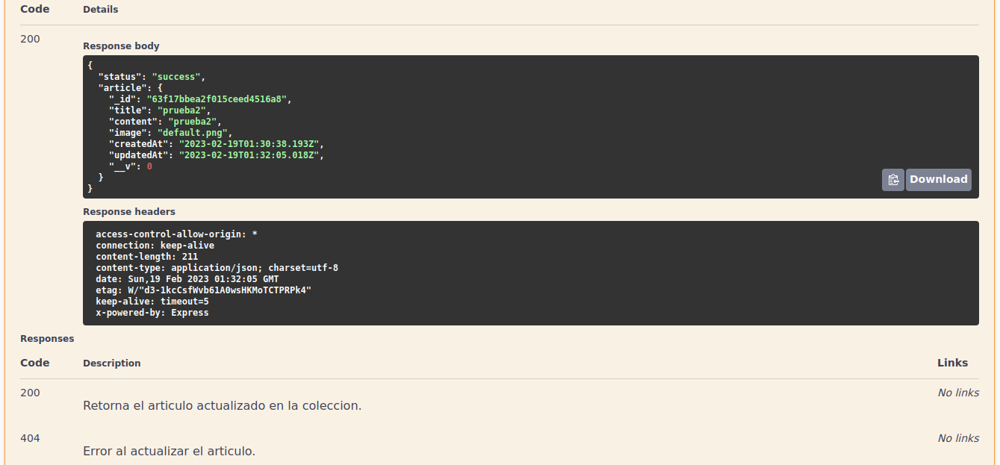

## **Documentacion de usuarios:**

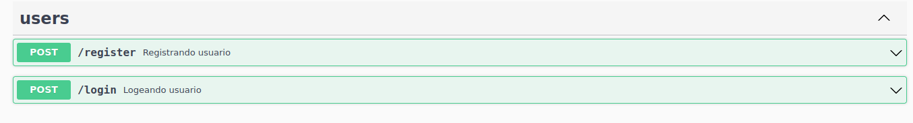
